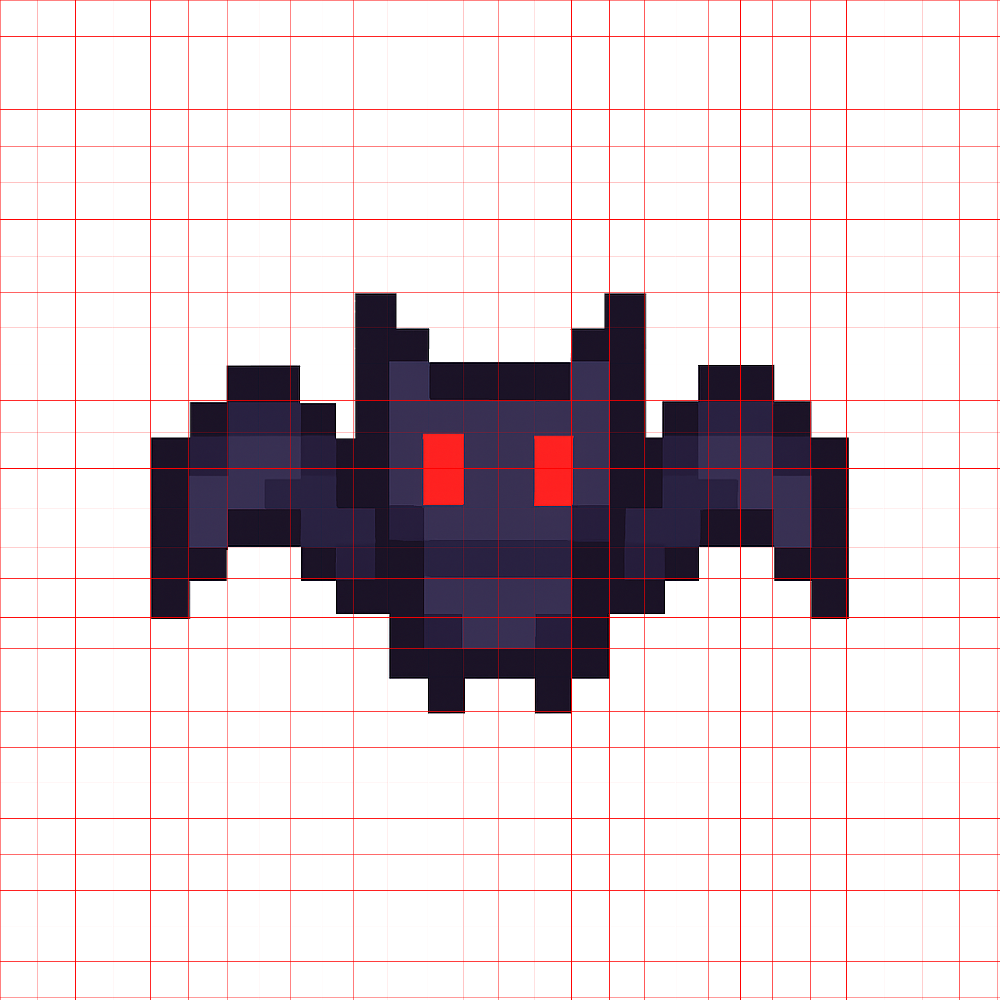

# Proper Pixel Art 
## Summary
- Converts text-to-art generated pixel-art-style images from LLMs to true pixel resolution assets.

- Extracts pixel art from screenshots.

## Installation

### Clone the Repository:
```bash
git clone git@github.com:KennethJAllen/proper-pixel-art.git
cd proper-pixel-art
```
### Create Virtual Environment

- Install [uv](https://docs.astral.sh/uv/getting-started/installation/) if not already installed.
- Sync environments
    - `uv sync`

## Usage

First, obtain a source image (e.g. a pixel-art-style image generated by GPT-4o or a screenshot of low‑quality art).

### Run the CLI

```bash
uv run ppa -i <input_path> -o <output_path> -c <num_colors> -p <pixel_size> [-t]
```

### Flags

| Flag                         | Description                                                                      |
| ---------------------------- | -------------------------------------------------------------------------------- |
| `-i`, `--input` `<path>`     | Source image file in pixel-art-style                                             |
| `-o`, `--output` `<path>`    | Output path for result                                                           |
| `-c`, `--colors` `<int>`     | Number of colors for output. May need to try a few different values (default 16) |
| `-p`, `--pixel-size` `<int>` | Size of each “pixel” in the output (default: 20)                                 |
| `-t`, `--transparent`        | Output with transparent background (default: off)                                |

### Example

`uv run ppa -i data/creatures/blob.png -o . -c 16 -p 20 -t`


## Examples

The algorithm is robust. It performs well for images that are already approximately alligned to a grid.

Here are a few examples. A mesh is computed, where each cell corresponds to one pixel.

### Bat
- Generated by GPT-4o. Note the noisy edges.

<table align="center" width="100%">
  <tr>
    <td width="33%">
      
      <br><small>Original</small>
    </td>
    <td width="33%">
      
      <br><small>Mesh</small>
    </td>
    <td width="33%">
      
      <br><small>Result</small>
    </td>
  </tr>
</table>

### Ash
- Screenshot from Google images of Pokemon asset.

<table align="center" width="100%">
  <tr>
    <td width="33%">
      
      <br><small>Original</small>
    </td>
    <td width="33%">
      
      <br><small>Mesh</small>
    </td>
    <td width="33%">
      
      <br><small>Result</small>
    </td>
  </tr>
</table>


### Demon
- Original image generated by GPT-4o.

<table align="center" width="100%">
  <tr>
    <td width="33%">
      
      <br><small>Original</small>
    </td>
    <td width="33%">
      
      <br><small>Mesh</small>
    </td>
    <td width="33%">
      
      <br><small>Result</small>
    </td>
  </tr>
</table>

### Pumpkin
- Screenshot from Google Images of Stardew Valley asset.

<table align="center" width="100%">
  <tr>
    <td width="33%">
      
      <br><small>Original</small>
    </td>
    <td width="33%">
      
      <br><small>Mesh</small>
    </td>
    <td width="33%">
      
      <br><small>Result</small>
    </td>
  </tr>
</table>


## Real Images To Pixel Art

- This tool can also be used to convert real images to pixel art by first requesting a pixelated version of the original image from GPT-4o, then using the tool to get the true pixel-resolution image.

- Consider this image of a mountain


- Here are the results of first requesting a pixalated version of the mountain, then using the tool to get a true resolution pixel art version.

<table align="center" width="100%">
  <tr>
    <td width="33%">
      
      <br><small>Original</small>
    </td>
    <td width="33%">
      
      <br><small>Mesh</small>
    </td>
    <td width="33%">
      
      <br><small>Result</small>
    </td>
  </tr>
</table>

## Challenges
The result of pixel-art style images from LLMs are noisy, high resolution images with a non-uniform grid and random artifacts. Due to these issues, standard downsampling techniques do not work. How can we recover the pixel art with "true" resolution and colors?

The current approach to turning pixel art into useable assets for games are either
1) Use naive downsampling which does not give a result that is faithful to the original image.
2) Manually re-create the image in the approperiate resolution pixel by pixel.

## Algorithm
- The main algorithm solves these challenges. Here is a high level overview. We will apply it step by step on this example image of blob pixel art that was generated from GPT-4o.


- Note that this image is high resolution and noisy.


1) Trim the edges of the image and zero out pixels with more than 50% alpha.
    - This is to work around some issues with models such as GPT-4o not giving a perfectly transparent background.

2) Find edges of the pixel art using [Canny edge detection](https://docs.opencv.org/3.4/da/d22/tutorial_py_canny.html).


3) Close small gaps in edges with a [morphological closing](https://docs.opencv.org/4.x/d9/d61/tutorial_py_morphological_ops.html).


4) Use [Hough transform](https://docs.opencv.org/3.4/d3/de6/tutorial_js_houghlines.html) to get the coordinates of lines in the detected edges. Only keep lines that are close to vertical or horizontal giving some grid coordinates.


5) Find the grid spacing by filtering outliers and taking the median of the spacings, then complete the mesh. Cluster points that are closeby together.


6) Quantize the original image to a small number of colors.
    - Note: The result is sensitive to the number of colors chosen.
    - The parameter is not difficult to tune, but the script may need to be re-run if the colors don't look right.
    - 8, 16, 32, or 64 typically works.
    - TODO: Find a heuristic for choosing the number of colors.

8) In each cell specified by the mesh, choose the most common color in the cell as the color for the pixel. Recreate the original image with one pixel per cell.

    - Result upsampled by a factor of $20 \times$


