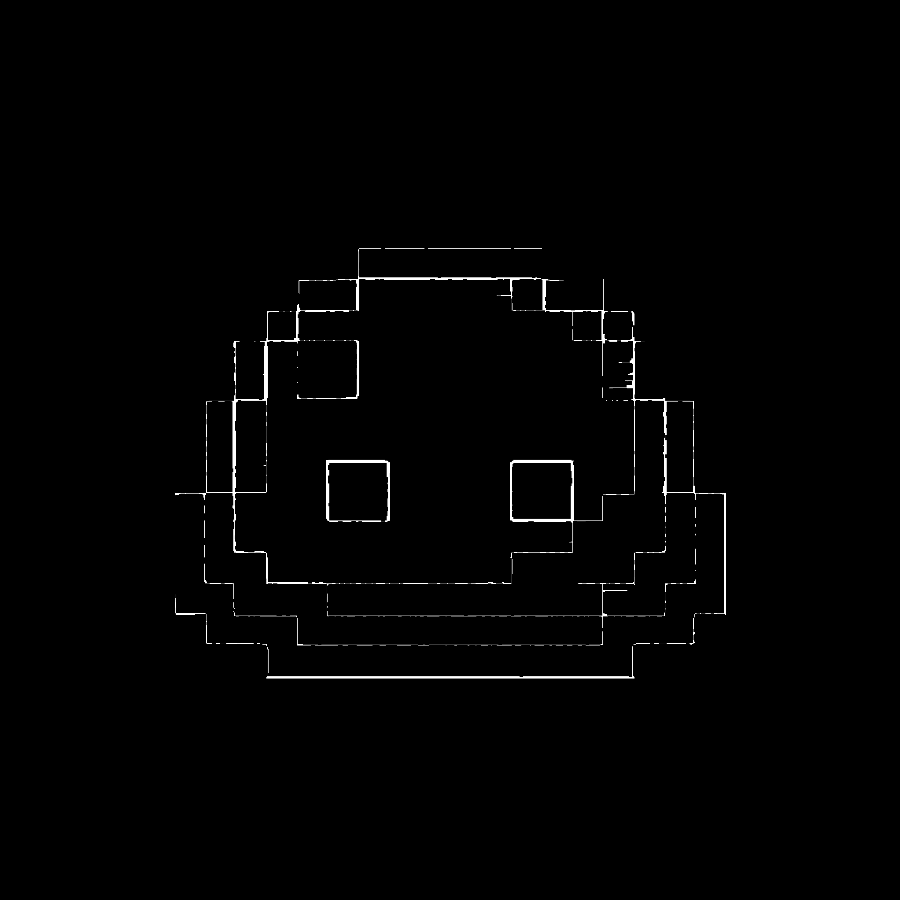

# Generative Pixel Art 
## Summary
- Converts text-to-art generated 'pixel' art from LLMs to true resolution pixel art assets for use in games

- Fix pixel art from low-quality video, streams, photographs, compression, or screenshots into usable sprites

## Installation

### Clone the Repository:
```bash
git clone git@github.com:KennethJAllen/generative-pixel-art.git
cd generative-pixel-art
```
### Create Virtual Environment

- Install [uv](https://docs.astral.sh/uv/getting-started/installation/) if not already installed.
- Sync environments
    - `uv sync`

## Using the Tool

1) Get a pixel art image from an LLM, e.g. GPT-4o, or pixel art from low-quality video, streams, photographs, or screenshots.
    - If using GPT-4o it is recommended to request a transparent background for the image.

2) Use CLI

```bash
python gen_pixel_art/cli.py -i <path/to/img> -c <num colors> -o <output/directory>
```
## Challenges
There are many challenges involved in solving this problem. If an LLM is prompted for a pixel art image, the result is a noisy, high resolution image with a non-uniform grid and random artifacts. Due to these issues, standard downsampling techniques do not work. How can we recover the pixel art with "true" resolution and colors?

The current approach to turning pixel art into useable assets for games are either
1) Use naive downsampling which does not give a result that is faithful to the original image.
2) Manually re-create the image in the approperiate resolution pixel by pixel.

## Algorithm
The main algorithm solves these challenges. Here is a high level overview of the algorithm. We will apply it step by step on this example image of blob pixel art that was generated from GPT-4o. Note that this image is high resolution and noisy.


1) Trim the edges of the image and zero out pixels with more than %50 alpha.
    - This is to work around some issues with models such as GPT-4o not giving a perfectly transparent background.

2) Find edges of the pixel art using [Canny edge detection](https://docs.opencv.org/3.4/da/d22/tutorial_py_canny.html).


3) Close small gaps in edges with a [morphological closing](https://docs.opencv.org/4.x/d9/d61/tutorial_py_morphological_ops.html).



4) Use [Hough transform](https://docs.opencv.org/3.4/d3/de6/tutorial_js_houghlines.html) to get the coordinates of lines in the detected edges. Only keep lines that are close to vertical or horizontal giving some grid coordinates.


5) Find the grid spacing by filtering outliers and taking the median, then complete the grid.


6) Quantize the original image to a small number of colors.

7) In each cell specified by the mesh, choose the most common color in the cell as the color for the pixel. Recreate the original image with one pixel per cell.

    - Result upscaled by a factor of $20 \times$


## Examples

The algorithm is robust. It performs well for images that are already approximately alligned to a grid. Here are a few examples

### Treasure
- Generated by GPT-4o.
#### Mesh

#### Result


### Bat
- Generated by GPT-4o
#### Mesh

#### Result


### Ash
- Screenshot from Google images of Pokemon asset.
#### Mesh

#### Result


### Demon
- Generated from GPT-4o
#### Mesh

#### Result


### Pumpkin
- Screenshot from Google Images of Stardew Valley asset.
#### Mesh

#### Result

